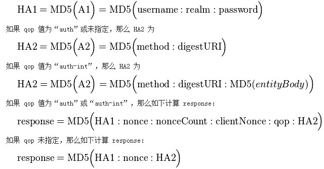
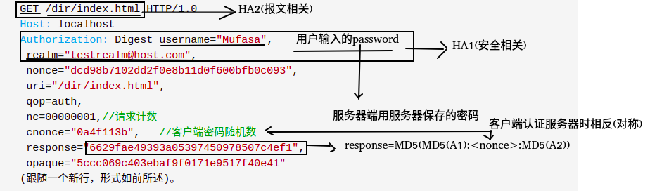

# http认证鉴权01基本认证和摘要认证
基本认证与摘要认证用于在HTTP报文交互中，服务端确认客户端身份。

## 基本认证
Base64(user:pwd)后，放在Http头的Authorization中发送给服务端来作认证.

用Base64纯只是防君子不防小人的做法。所以只适合用在一些不那么要求安全性的场合。


## 摘要认证
digest authentication（HTTP1.1提出的基本认证的替代方法）

这个认证可以看做是基本认证的增强版本，不包含密码的明文传递。

引入了一系列安全增强的选项；“保护质量”(qop)、随机数计数器由客户端增加、以及客户生成的随机数。



在HTTP摘要认证中使用 MD5 加密是为了达成"不可逆的"，也就是说，当输出已知的时候，确定原始的输入应该是相当困难的。如果密码本身太过简单，也许可以过尝试所有可能的输入来找到对应的输出（穷举攻击），甚至可以通过字典或者适当的查找表加快查找速度。


**认证过程**

```
客户端请求一个需要认证的页面，但是不提供用户名和密码。通常这是由于用户简单的输入了一个地址或者在页面中点击了某个超链接。
服务器返回401 "Unauthorized" 响应代码，并提供认证域(realm)，以及一个随机生成的、只使用一次的数值，称为密码随机数 nonce。
此时，浏览器会向用户提示认证域(realm)（通常是所访问的计算机或系统的描述），并且提示用户名和密码。用户此时可以选择取消。
一旦提供了用户名和密码，客户端会重新发送同样的请求，但是添加了一个认证头包括了响应代码。
注意：客户端可能已经拥有了用户名和密码，因此不需要提示用户，比如以前存储在浏览器里的。
```

客户端请求 (无认证)：

```
    GET /dir/index.html HTTP/1.0
    Host: localhost
    (跟随一个新行，形式为一个回车再跟一个换行）
```
服务器响应：

```
    HTTP/1.0 401 Unauthorized
    Server: HTTPd/0.9
    Date: Sun, 10 Apr 2005 20:26:47 GMT
    WWW-Authenticate: Digest realm="testrealm@host.com",   //认证域
    qop="auth,auth-int",   //保护质量
    nonce="dcd98b7102dd2f0e8b11d0f600bfb0c093",  //服务器密码随机数
    opaque="5ccc069c403ebaf9f0171e9517f40e41"
    Content-Type: text/html
    Content-Length: 311


    <!DOCTYPE HTML PUBLIC "-//W3C//DTD HTML 4.01 Transitional//EN"
     "http://www.w3.org/TR/1999/REC-html401-19991224/loose.dtd">
    <HTML>
      <HEAD>
    <TITLE>Error</TITLE>
    <META HTTP-EQUIV="Content-Type" CONTENT="text/html; charset=ISO-8859-1">
      </HEAD>
      <BODY><H1>401 Unauthorized.</H1></BODY>
    </HTML>
```
客户端请求 (用户名 "Mufasa", 密码 "Circle Of Life")：

```
    GET /dir/index.html HTTP/1.0
    Host: localhost
    Authorization: Digest username="Mufasa",# 用户输入或浏览器保存
     realm="testrealm@host.com",# 上一步:服务器响应里的
     nonce="dcd98b7102dd2f0e8b11d0f600bfb0c093",# 上一步:服务器响应里的
     uri="/dir/index.html",
     qop=auth,
     nc=00000001,//请求计数
     cnonce="0a4f113b",   //客户端密码随机数
     response="6629fae49393a05397450978507c4ef1",
     opaque="5ccc069c403ebaf9f0171e9517f40e41"
    (跟随一个新行，形式如前所述)。
```
这里面的均是报文明文，可见里面没有password


服务器响应：

```
    HTTP/1.0 200 OK
    Server: HTTPd/0.9
    Date: Sun, 10 Apr 2005 20:27:03 GMT
    Content-Type: text/html
    Content-Length: 7984
    (随后是一个空行，然后是所请求受限制的HTML页面)
```

response 值由三步计算而成。当多个数值合并的时候，使用冒号作为分割符：

```
1、对用户名、认证域(realm)以及密码的合并值计算 MD5 哈希值，结果称为 HA1(安全相关)。
若算法是：MD5
则A1=<user>:<realm>:<password>
若算法是：MD5-sess
则A1=MD5(<user>:<realm>:<password>):<nonce>:<cnonce>

2、对HTTP方法以及URI的摘要的合并值计算 MD5 哈希值，例如，"GET" 和 "/dir/index.html"，结果称为 HA2(报文相关)。
A2表示是与报文自身相关的信息，比如URL，请求反复和报文实体的主体部分，A2加入摘要计算主要目的是有助于防止反复，资源或者报文被篡改。
若qop未定义或者auth：
A2=<request-method>:<uri-directive-value>
若qop为auth:-int
A2=<request-method>:<uri-directive-value>:MD5(<request-entity-body>)

3、对HA1、服务器密码随机数(nonce)、请求计数(nc)、客户端密码随机数(cnonce)、保护质量(qop)以及 HA2 的合并值计算 MD5 哈希值。结果即为客户端提供的response 值。
摘要的计算规则：
若qop没有定义：摘要response=MD5(MD5(A1):<nonce>:MD5(A2))
若qop为auth:摘要response=MD5(MD5(A1):<nonce>:<nc>:<cnonce>:<qop>:MD5(A2))
若qop为auth-int:摘要response= MD5(MD5(A1):<nonce>:<nc>:<cnonce>:<qop>:MD5(A2))
```

因为服务器拥有与客户端同样的信息，因此服务器可以进行同样的计算，以验证客户端提交的 response 值的正确性。在上面给出的例子中，结果是如下计算的。（MD5()表示用于计算MD5哈希值的函数；“\”表示接下一行；引号并不参与计算）

```
HA1 = MD5( "Mufasa:testrealm@host.com:Circle Of Life" )
       = 939e7578ed9e3c518a452acee763bce9

HA2 = MD5( "GET:/dir/index.html" )
       = 39aff3a2bab6126f332b942af96d3366

Response = MD5( "939e7578ed9e3c518a452acee763bce9:\
                         dcd98b7102dd2f0e8b11d0f600bfb0c093:\
00000001:0a4f113b:auth:\
39aff3a2bab6126f332b942af96d3366" )
= 6629fae49393a05397450978507c4ef1
```
此时客户端可以提交一个新的请求，重复使用服务器密码随机数(nonce)（服务器仅在每次“401”响应后发行新的nonce），但是提供新的客户端密码随机数(cnonce)。在后续的请求中，十六进制请求计数器(nc)必须比前一次使用的时候要大，否则攻击者可以简单的使用同样的认证信息重放老的请求。由服务器来确保在每个发出的密码随机数nonce时，计数器是在增加的，并拒绝掉任何错误的请求。显然，改变HTTP方法和/或计数器数值都会导致不同的 response值。

服务器应当记住最近所生成的服务器密码随机数nonce的值。也可以在发行每一个密码随机数nonce后，记住过一段时间让它们过期。如果客户端使用了一个过期的值，服务器应该响应“401”状态号，并且在认证头中添加stale=TRUE，表明客户端应当使用新提供的服务器密码随机数nonce重发请求，而不必提示用户其它用户名和口令。

综合图




## 其他认证方式
**Cookie**

Cookie认证机制就是为一次请求认证在服务端创建一个Session对象，同时在客户端的浏览器端创建了一个Cookie对象；通过客户端带上来Cookie对象来与服务器端的session对象匹配来实现状态管理的。默认的，当我们关闭浏览器的时候，cookie会被删除。但可以通过修改cookie 的expire time使cookie在一定时间内有效；


**OAuth**

OAuth（开放授权）是一个开放的授权标准，允许用户让第三方应用访问该用户在某一web服务上存储的私密的资源（如照片，视频，联系人列表），而无需将用户名和密码提供给第三方应用。

这种基于OAuth的认证机制适用于个人消费者类的互联网产品，如社交类APP等应用


**Token**

json_web_token


**CSRF**

HTTP常用认证机制


## 参考
HTTP基本认证和摘要认证：https://blog.csdn.net/xcl168/article/details/49475381

详解HTTP中的摘要认证机制：https://blog.csdn.net/tenfyguo/article/details/8661517

HTTP授权验证：https://www.jianshu.com/p/ebc297b51b3e

HTTP认证与https简介：https://www.cnblogs.com/xzwblog/p/6834663.html


