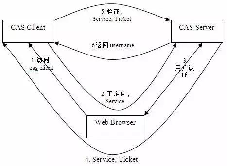

# http认证鉴权02CAS和SSO(单点登录)
单点登录（ Single Sign-On , 简称 SSO ）是目前比较流行的服务于企业业务整合的解决方案之一， SSO 使得在多个应用系统中，用户只需要 **登录一次**就可以访问所有相互信任的应用系统


## 主要角色

1、 User （多个）

2、 Web 应用（多个）

3、 SSO 认证中心（ **1个**）

## 实现模式的原则

SSO 实现模式一般包括以下三个原则：

1、 所有的认证登录都在 SSO 认证中心进行；

2、 SSO 认证中心通过一些方法来告诉 Web 应用当前访问用户究竟是不是已通过认证的用户；

3、 SSO 认证中心和所有的 Web 应用建立一种信任关系，也就是说 web 应用必须信任认证中心。（单点信任）

## CAS 的基本原理

**结构**

CAS分为两部分，CAS Server和CAS Client

```
CAS Server用来负责用户的认证工作，就像是把第一次登录用户的一个标识存在这里，以便此用户在其他系统登录时验证其需不需要再次登录。  
CAS Client就是我们自己的应用，需要接入CAS Server端。当用户访问我们的应用时，首先需要重定向到CAS Server端进行验证，要是原来登陆过，就免去登录，重定向到下游系统，否则进行用户名密码登陆操作。  
```
**术语**

```
Ticket Granting ticket (TGT) ：可以认为是CAS Server根据用户名密码生成的一张票，存在server端  
Ticket-granting cookie (TGC) ：其实就是一个cookie，存放用户身份信息，由server发给client端  
Service ticket (ST) ：由TGT生成的一次性票据，用于验证，只能用一次。相当于server发给client一张票，然后client拿着这是个票再来找server验证，看看是不是server签发的。就像是我给了你一张我的照片，然后你拿照片再来问我，这个照片是不是你。。。没错，就是这么无聊。  
```

**基础协议图**




如上图： CAS Client 与受保护的客户端应用部署在一起，以 Filter 方式保护 Web 应用的受保护资源，过滤从客户端过来的每一个 Web 请求，同时， CAS Client 会分析 HTTP 请求中是否包含请求 Service Ticket( ST 上图中的 Ticket) ，如果没有，则说明该用户是没有经过认证的；于是 CAS Client 会重定向用户请求到 CAS Server （ Step 2 ），并传递 Service （要访问的目的资源地址）。 Step 3 是用户认证过程，如果用户提供了正确的 Credentials ， CAS Server 随机产生一个相当长度、唯一、不可伪造的 Service Ticket ，并缓存以待将来验证，并且重定向用户到 Service 所在地址（附带刚才产生的 Service Ticket ） , **并为客户端浏览器设置一个 Ticket Granted Cookie （ TGC ）**； CAS Client 在拿到 Service 和新产生的 Ticket 过后，在 Step 5 和 Step6 中与 CAS Server 进行身份核实，以确保 Service Ticket 的合法性。

在该协议中，所有与 CAS Server 的交互均采用 SSL 协议，以确保 ST 和 TGC 的安全性。协议工作过程中会有 **2 次重定向**的过程。但是 CAS Client 与 CAS Server 之间进行 Ticket 验证的过程对于用户是透明的（使用 HttpsURLConnection ）。


## CAS 如何实现 SSO

当用户访问另一个应用的服务再次被重定向到 CAS Server 的时候， CAS Server 会主动获到这个 TGC cookie ，然后做下面的事情：

如果 User 持有 TGC 且其还没失效，那么就走基础协议图的 Step4 ，达到了 SSO 的效果；

如果 TGC 失效，那么用户还是要重新认证 ( 走基础协议图的 Step3) 。


## CAS 安全性

CAS 的安全性仅仅依赖于 SSL 。使用的是 secure cookie 。

**TGC/PGT安全性**

对于一个 CAS 用户来说，最重要是要保护它的 TGC ，如果 TGC 不慎被 CAS Server 以外的实体获得， Hacker 能够找到该 TGC ，然后冒充 CAS 用户访问 **所有**授权资源。 PGT 的角色跟 TGC 是一样的。

从基础模式可以看出， TGC 是 CAS Server 通过 SSL 方式发送给终端用户，因此，要截取 TGC 难度非常大，从而确保 CAS 的安全性。

TGT 的存活周期默认为 120 分钟

**ST/PT安全性**

ST （ Service Ticket ）是通过 Http 传送的，因此网络中的其他人可以 Sniffer 到其他人的 Ticket 。 CAS 通过以下几方面来使 ST 变得更加安全（事实上都是可以配置的）：

1、 ST 只能使用一次

CAS 协议规定，无论 Service Ticket 验证是否成功， CAS Server 都会清除服务端缓存中的该Ticket ，从而可以确保一个 Service Ticket 不被使用两次。

2、 ST 在一段时间内失效

CAS 规定 ST 只能存活一定的时间，然后 CAS Server 会让它失效。默认有效时间为 5 分钟。

3、 ST 是基于随机数生成的

ST 必须足够随机，如果 ST 生成规则被猜出， Hacker 就等于绕过 CAS 认证，直接访问 对应的服务。


## CAS和SSO关系
SSO 仅仅是一种架构，一种设计，而**CAS 则是实现 SSO 的一种手段**。两者是**抽象与具体的关系**。当然，除了 CAS 之外，实现 SSO 还有其他手段，比如简单的 cookie。
## 参考
一篇文章彻底弄懂CAS实现SSO单点登录原理：https://www.cnblogs.com/wangsongbai/p/10299655.html

什么是 SSO 与 CAS?：https://www.cnblogs.com/btgyoyo/p/10722010.html

基于CAS实现SSO单点登录：https://zhuanlan.zhihu.com/p/25007591


