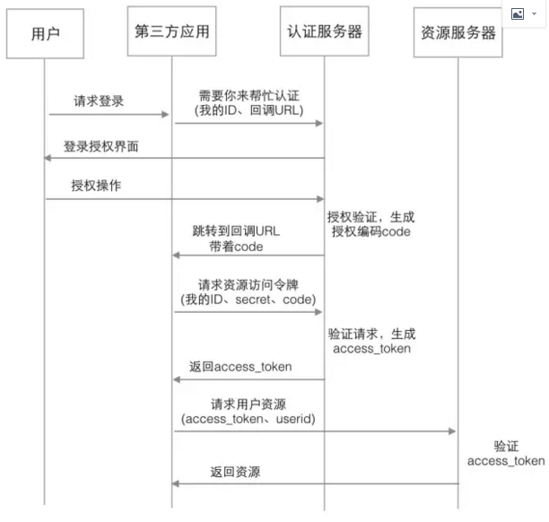
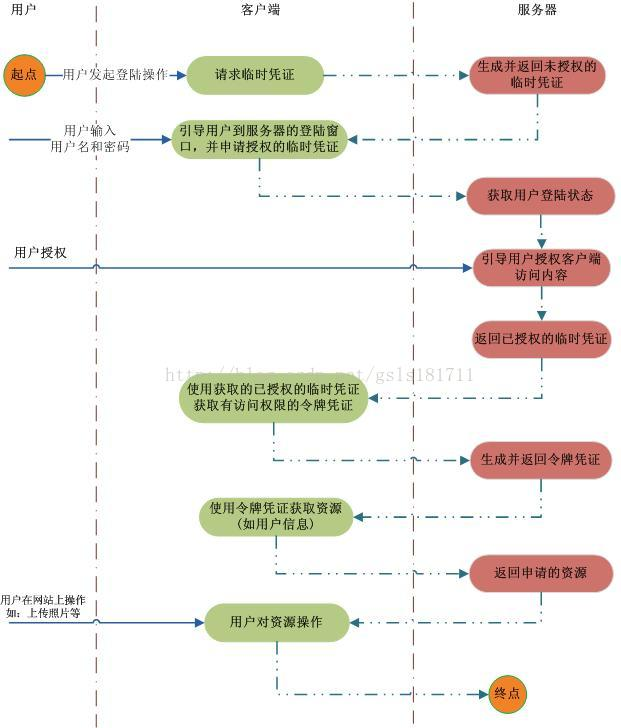
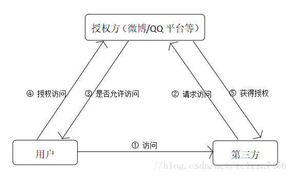
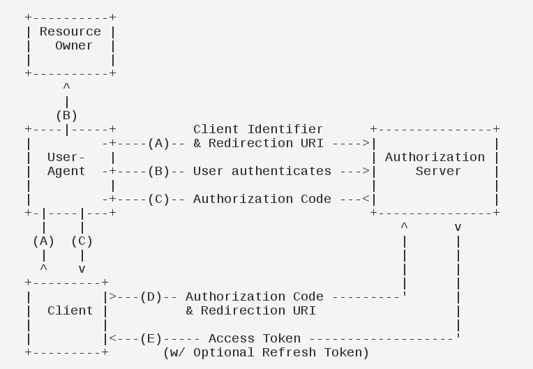

# http认证鉴权03OAuth2入门
OAuth（Open Authorization，开放授权）是为用户资源的授权定义了一个安全、开放及简单的标准，第三方无需知道用户的账号及密码，就可获取到用户的授权信息。

OAuth在"客户端"与"服务提供商"之间，设置了一个授权层，"客户端"不能直接登录"服务提供商"，只能登录授权层，以此将用户与客户端区分开 来，"客户端"登录授权层是使用令牌（token），"客户端"登录授权层以后，"服务提供商"根据令牌的权限范围和有效期，向"客户端"开放用户储存的资料

## 实现机制

在OAuth2的授权机制中有4个核心对象

```
（1）Resource Owner（资源拥有者：用户）  
（2）Client （第三方接入平台：请求者，例如网站）  
（3）Resource Server （资源服务器，存储例如用户信息等资源）  
（4）Authorization Server （认证服务器）  
```
步骤:




```
（1）用户在第三方应用上点击登录，应用向认证服务器发送请求，说有用户希望进行授权操作，同时说明自己是谁、用户授权完成后的回调url  
（2）认证服务器展示给用户自己的授权界面  
（3）用户进行授权操作，认证服务器验证成功后，生成一个授权编码code，并跳转到第三方的回调url  
（4）第三方应用拿到code后，连同自己在平台上的身份信息（ID密码）发送给认证服务器，再一次进行验证请求，说明自己的身份正确，并且用户也已经授权我了，来换取访问用户资源的权限  
（5）认证服务器对请求信息进行验证，如果没问题，就生成访问资源服务器的令牌access_token，交给第三方应用  
（6）第三方应用使用access_token向资源服务器请求资源  
（7）资源服务器验证access_token成功后返回响应资源  
```
其他流程图







授权码模式（authorization code）是功能最完整、流程最严密的授权模式。它的特点就是通过客户端的后台服务器，与"服务提供商"的认证服务器进行互动。



步骤

```
（A）用户访问客户端，后者将前者导向认证服务器。  
（B）用户选择是否给予客户端授权。  
（C）假设用户给予授权，认证服务器将用户导向客户端事先指定的"重定向URI"（redirection URI），同时附上一个授权码。  
（D）客户端收到授权码，附上早先的"重定向URI"，向认证服务器申请令牌。这一步是在客户端的后台的服务器上完成的，对用户不可见。  
（E）认证服务器核对了授权码和重定向URI，确认无误后，向客户端发送访问令牌（access token）和更新令牌（refresh token）。  
```

## 参考
OAuth2认证原理:https://blog.csdn.net/fsy9595887/article/details/85114508

OAuth2实现原理:https://www.cnblogs.com/chinanetwind/articles/9457842.html

OAuth2.0认证原理浅析:https://blog.csdn.net/tclzsn7456/article/details/79550249

CAS与OAuth2的区别：https://www.cnblogs.com/boboooo/p/9041355.html

理解OAuth 2.0：https://www.ruanyifeng.com/blog/2014/05/oauth_2_0.html