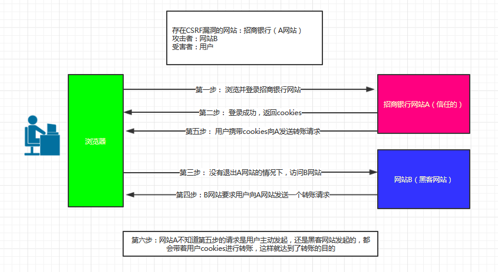
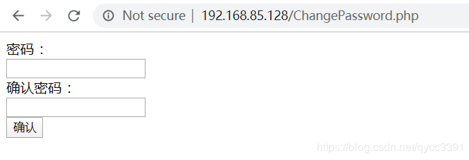
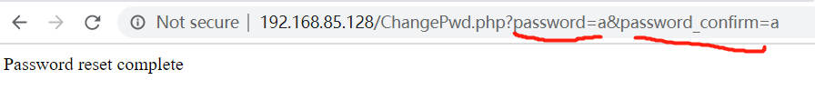
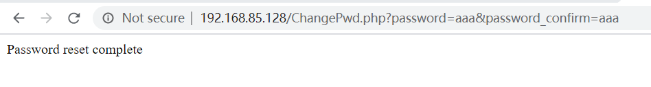
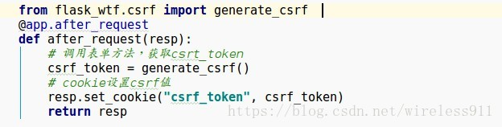
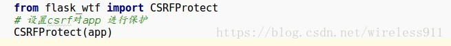
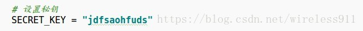
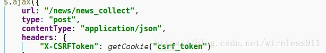

# http认证鉴权04CSRF跨站请求伪造
攻击者盗用了你的身份，以你的名义发送恶意请求，对服务器来说这个请求是完全合法的，但是却完成了攻击者所期望的一个操作，比如以你的名义发送邮件、发消息，盗取你的账号，添加系统管理员，甚至于购买商品、虚拟货币转账等。 如下：其中Web A为存在CSRF漏洞的网站，Web B为攻击者构建的恶意网站，User C为Web A网站的合法用户

## CSRF攻击原理


从上图可以看出，要完成一次CSRF攻击，受害者必须依次完成两个步骤：

```
1.登录受信任网站A，并在本地生成Cookie。
2.在不登出A的情况下，访问危险网站B。
```
看到这里，你也许会说：“如果我不满足以上两个条件中的一个，我就不会受到CSRF的攻击”。是的，确实如此，但你不能保证以下情况不会发生：

```
1.你不能保证你登录了一个网站后，不再打开一个tab页面并访问另外的网站。
2.你不能保证你关闭浏览器了后，你本地的Cookie立刻过期，你上次的会话已经结束。（事实上，**关闭浏览器不能结束一个会话**，但大多数人都会错误的认为关闭浏览器就等于退出登录/结束会话了......）
3.上图中所谓的攻击网站，可能是一个存在其他漏洞的可信任的经常被人访问的网站。
```
## 攻击实例(get为例,post亦可,见参考文献)
已有网站界面如下：



假设现在用户a需要修改密码，用户输入密码以后，界面如下：



用户A通过**抓包或者观察URL**发现，当修改密码时，向服务器发送了两个参数，password = a 和 password_confirm = a。那么如果将这个链接发送给别人，就可以修改别人的密码了。

于是，用户A将URL http://192.168.85.128/ChangePwd.php?password=aaa&password_confirm=aaa发送给了用户admin，并附上一些**诱导点开**的话。由于**此网站有“保持登陆状态”的设置**，当用户admin点击了这条URL的时候，发现自己的密码已经被修改了。



如果admin并没有发现问题，关闭了网页。结果下次登陆网站的时候，发现自己的账户密码已经被修改了，仅仅是因为点击了一条URL！

而发送链接的用户A，也可以轻松使用修改后的密码进行登陆了。


## 解决CSRF攻击
使用csrf_token校验

### flask的csrf配置
1.客户端和浏览器向后端发送请求时，后端往往会在响应中的 cookie 设置 csrf_token 的值，可以使用请求钩子实现，在cookie中设置csrf_token



2.flask_wtf 中为我们提供了CSRF保护，可以直接调用开启对app的保护


一旦开启CSRF保护，就要设置秘钥：SECRET_KEY




**csrf验证**

**1.表单提交方式**

服务器通过请求钩子在cookie中设置了csrf_token,实际上是在session中存储了未加密的csrf_token，并且将生成的sessionID编号存储在cookie中

在表单中我们添加了csrf的隐藏字段，在浏览器再次访问服务器时：

```
1.获取到表单中的csrf_token(加密的)，使用secret_key进行解密，得到解密后的csrf_token  
2.通过cookie中的sessionID，取到服务器内部存储的session中的csrf_token(未加密的)  
3.将两者的值进行比较  
```
**2.ajax提交请求方式**

在js里面，获取到cookie中的csrf_token,将其添加到ajax的请求头中



验证过程:

```
1.获取请求头中的csrf_token（加密的），然后使用secret_key解密，得到解密后csrf_token。
2.通过cookie中的sessionID，取到服务器内部存储的session中的csrf_token(未加密的)。
3.将两者的值进行比较
```
### django的csrf配置
**配置修改**

django:settings.py

```
'django.middleware.csrf.CsrfViewMiddleware' # 认证系统,如果不加，则不进行认证
```
django模板渲染: 先进行django模板渲染(render)，再返回浏览器

```
<form action="" method="post">
      # post请求加上csrf_token(安全令牌),每次POST请求都会令牌比对, 写在form表单的任意位置
    username: <input type="text" name="username">
    password: <input type="text" name="password">
    <input type="submit">
</form>
```
浏览器get请求，服务器响应包含post请求的html页面,服务器后端会自动保存一份name=csrfmiddlewaretoken,和value值的数据以备浏览器post认证，浏览器post请求时会加上name和value值，服务器端收到post请求后会比对value值，如果匹配则响应post请求，如果匹配不成功则拒绝响应.


**csrf_token验证：post**

方法1:前端form表单中取隐藏标签属性值放入data中post到后端, contentType: urlencoded 适用

```
$.ajax({
	data:{
		csrfmiddlewaretoken:$('[name="csrfmiddlewaretoken"]').val()
		}
	})
```
方法2:ajaxSetup：django将csrftoken传送到前端，前端post时携带这个值,

```
$.ajaxSetup({data:csrfmiddlewaretoken='{{csrf_token}})
```
方法3:发送contenttype类型数据时,通过获取响应返回的cookie中的字符串， 放置在请求头中发送。需要引入一个jquery.cokkie.js插件-----json， form-data适用

```

<script src=""></script>

$.ajax{{
	headers:{"X-CSRFToken":$.cookie("csrftoken")},
}}
```
## 参考
浅谈CSRF（Cross-site request forgery）跨站请求伪造（写的非常好）：https://www.cnblogs.com/liuqingzheng/p/9505044.html

web安全学习笔记（九）CSRF（Cross-Site Request Forgery） 跨站请求伪造：https://blog.csdn.net/qycc3391/article/details/104741756

csrf验证机制：https://blog.csdn.net/wireless911/article/details/81589202

csrf认证：https://www.cnblogs.com/relaxlee/p/12842639.html

CSRF认证的几种方法：https://blog.csdn.net/mildddd/article/details/81083088


